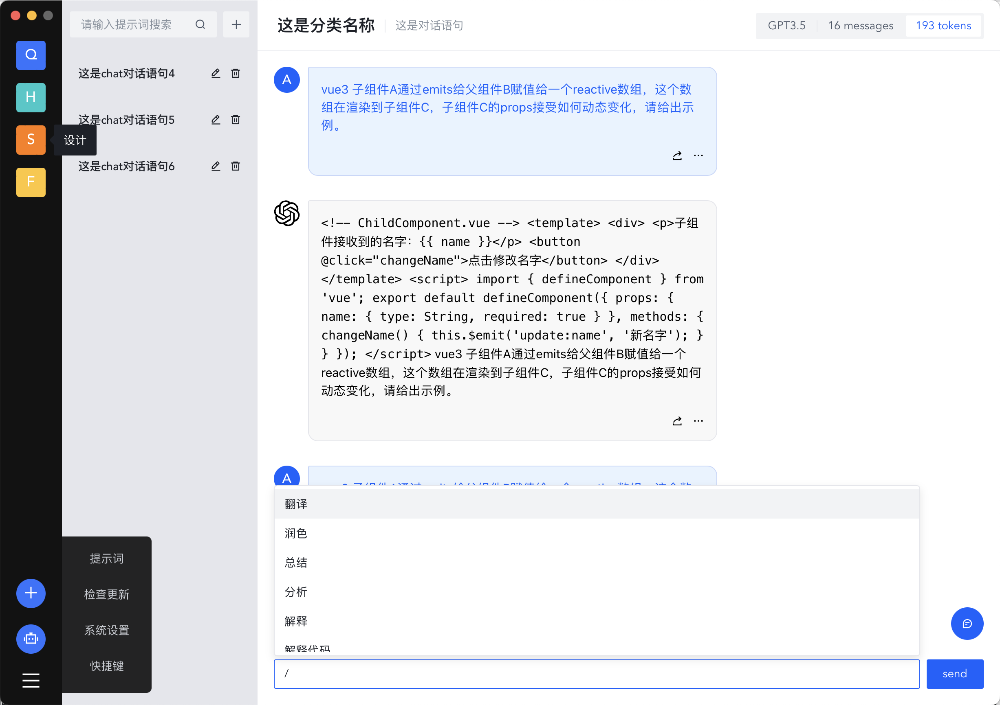

<p align="center" style="text-align: center">

</p>

### 更安全、更高效、更聚合 基于 chatGPT 的一体化效率工具

中文文档 | [English](README.md)

下载地址:

- [Chatcat Mac Intel v0.1.0-Beta.dmg](https://github.com/MQEnergy/chatcat/releases/download/v0.1.0/chatcat-amd64-installer.dmg) (英特尔芯片)
- [Chatcat Mac M1/M2 v0.1.0-Beta.dmg](https://github.com/MQEnergy/chatcat/releases/download/v0.1.0/chatcat-arm64-installer.dmg) (苹果芯片)
- [Chatcat Win x64 v0.1.0-Beta.exe](https://github.com/MQEnergy/chatcat/releases/download/v0.1.0/chatcat-amd64-installer.exe) (支持window7系统64位及以上)

[](https://github.com/MQEnergy/chatcat/blob/main/LICENSE)
[](https://goreportcard.com/report/github.com/MQEnergy/chatcat)
[](https://codebeat.co/projects/github-com-mqenergy-chatcat-main)
[](https://github.com/MQEnergy/chatcat/stargazers)

# Chatcat

聊天猫 更安全高效的ChatGPT客户端 支持 Mac（Intel、M1、M2）、win7及以上64位系统

## 功能介绍
1. 分类管理：对对话内容列表进行分门别类的管理
2. 提示词管理：将自己优质的提示词进行统一管理，便于分享和使用
3. 通用配置：配置秘钥，设置API模型，设置国际化，主题
4. 数据同步：可注册线上环境，便于分享提示词和对话内容
5. 对话管理：本地保存对话内容，方便管理
6. 高级设置：可动态调节GPT对话参数，如：随机性，附带历史消息数，单词回复限制等.

## 使用截图
<p align="center" style="text-align: center">



</p>

## 技术栈
vue3 + arco.design + golang + wails + sqlite

## 本地开发
官方安装[wails](https://github.com/wailsapp/wails) 进行打包

注意： 官方的wails打包 不能在`win7`下运行，

需要下载[MQEnergy/wails](https://github.com/MQEnergy/wails) ，并本地编译安装才支持win7
```shell
cd wails/v2/cmd/wails
go install .
```
运行测试
```shell
# 
make dev
```

## 安装包
### Mac环境
#### 1、依照本机环境打包
```shell
# ENV参数为test(测试) prod(正式) 以正式为例如下：
make build ENV=prod

# 打包 dmg
make dmg
```

#### 2、打包其他环境安装包
```shell
# amd64
make darwin/amd64 ENV=prod

# arm64
make darwin/arm64 ENV=prod
```

## Window环境

注意:以下环境安装包需要根据你的电脑架构来打包，否则可能打包不成功

```shell
# amd64是X86架构的CPU，64位版。amd64又叫X86_64。主流的桌面PC，笔记本电脑，服务器（包括虚拟机）都在用X86_64的CPU。
make windows/amd64 ENV=prod

# arm64是ARM架构的CPU，64位版
make windows/arm64 ENV=prod

# win32
make windows/386 ENV=prod
```