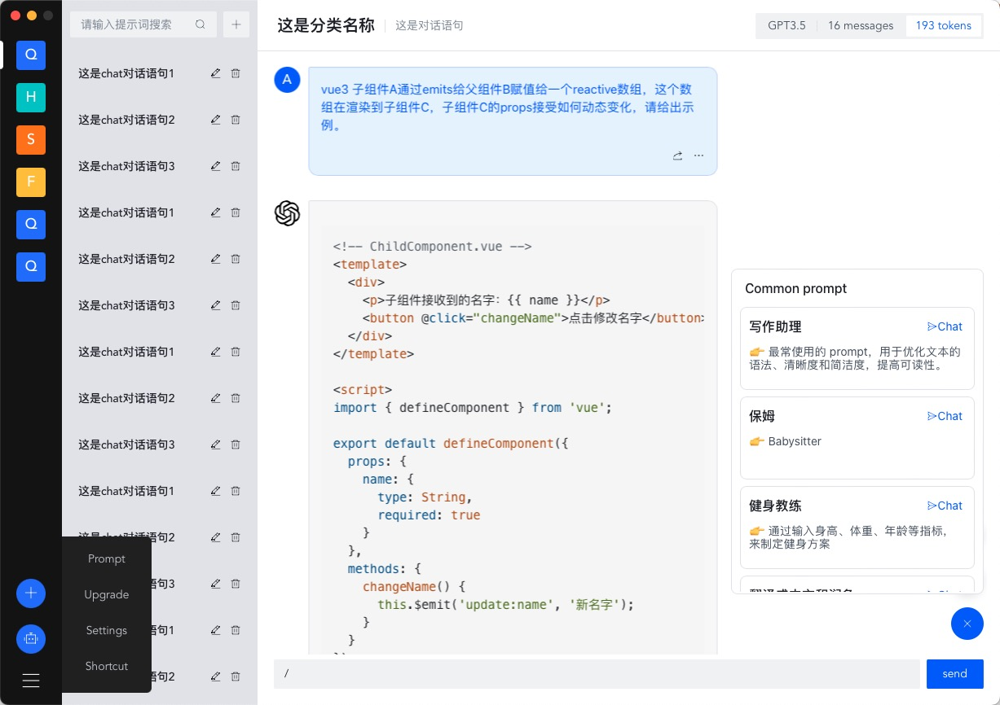

<p align="center" style="text-align: center">

</p>

# chatcat
ChatCat ChatGPT Client Supports Mac (Intel, M1, M2), win7 and above systems

<p align="center" style="text-align: center">



</p>

English | [中文文档](README-zh_CN.md)

## Technology Stack
Vue3 + arco.design + golang + wails + sqlite

## Instructions
Install Wails
```
go install github.com/wailsapp/wails/v2/cmd/wails@latest
```
Note:
The official Wails packaging cannot run on win7. To support win7, you need to download it from the following link and compile and install it locally.
```
https://github.com/MQEnergy/wails
```

### Mac Packaging
```shell
# 
wails build
```

### Windows Packaging
```shell
# md64 refers to X86 architecture CPU, 64-bit version. X86_64 is also known as X86_64. Mainstream desktop PCs, laptops, servers (including virtual machines) are all using X86_64 CPUs.
wails build -platform=windows/amd64

# Arm64 refers to ARM architecture CPU, 64-bit version. Apple's new computers are using ARM architecture CPUs. Some routers and embedded devices use Arm64 CPUs. The CPU most commonly used in mobile phones and Android tablets is also ARM architecture.
wails build -platform=windows/arm64
```