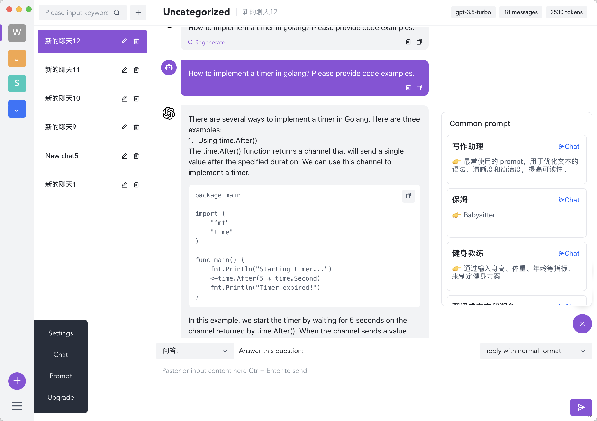
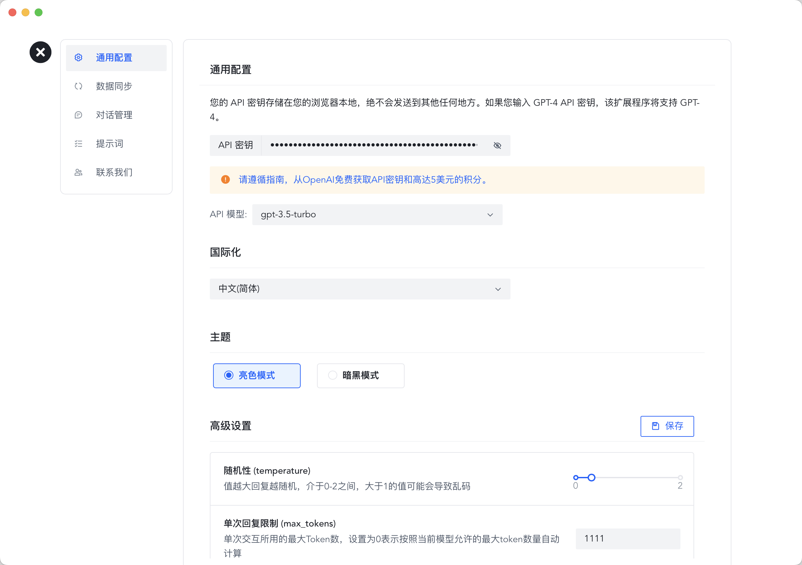

<p align="center" style="text-align: center">

</p>

### More Secure、Efficient、Integrated An chatGPT-based integrated efficiency tool

[](https://github.com/MQEnergy/chatcat/blob/main/LICENSE)
[](https://goreportcard.com/report/github.com/MQEnergy/chatcat)
[](https://codebeat.co/projects/github-com-mqenergy-chatcat-main)
[](https://github.com/MQEnergy/chatcat/stargazers)

English | [中文文档](README-zh_CN.md)

Download:

- [Chatcat Mac Intel v0.1.2-Beta.dmg](https://github.com/MQEnergy/chatcat/releases/download/v0.1.2/chatcat-amd64-installer.dmg) (Intel CPU)
- [Chatcat Mac M1/M2 v0.1.2-Beta.dmg](https://github.com/MQEnergy/chatcat/releases/download/v0.1.2/chatcat-arm64-installer.dmg) (Apple CPU)
- [Chatcat Win x64 v0.1.2-Beta.exe](https://github.com/MQEnergy/chatcat/releases/download/v0.1.2/chatcat-amd64-installer.exe) (Supports Windows7 64-bit and above)

# Chatcat
ChatCat More Safety ChatGPT Client Supports Mac (Intel, M1, M2), win7 64-bit and above systems

## Introduction
1. Classification Management: Manage dialogue content lists by category.
2. Prompt Word Management: Manage your own high-quality prompt words in a unified way for easy sharing and use.
3. Common Configuration: Configure keys, set API models, set internationalization, and themes.
4. Data Synchronization: Register online environments for sharing prompt words and dialogue content.
5. Dialogue Management: Save dialogue content locally for easy management.
6. Advanced Settings: Dynamic adjustment of GPT conversation parameters can be made, such as randomness, the number of attached historical messages, word reply limits, etc.

## Screenshots
<p align="center" style="text-align: center">



</p>

## Technology Stack
Vue3 + arco.design + golang + wails + sqlite

## Local Development
Install [wails](https://github.com/wailsapp/wails) from the official source for packaging.

Note: The official wails packaging cannot run on `win7`. To support `win7`, download [MQEnergy/wails](https://github.com/MQEnergy/wails) and compile it locally:
```shell
cd wails/v2/cmd/wails
go install .
```
Run the tests:
```shell
# 
make dev
```

## Installation Package
### Mac Environment
#### 1. Package according to the local environment
```shell
# The ENV parameter can be set to test (for testing) or prod (for production), for example:
make build ENV=prod

# Package into dmg format
make dmg
```

#### 2、Package installation packages for other environments.
```shell
# amd64
make darwin/amd64 ENV=prod

# arm64
make darwin/arm64 ENV=prod
```

## Windows Environment

Note: The installation packages below need to be packaged according to your computer architecture, otherwise the packaging may not be successful.

```shell
# amd64 is a 64-bit version of the X86 architecture CPU. It is also known as X86_64. It is widely used in mainstream desktop PCs, laptops, and servers (including virtual machines).
make windows/amd64 ENV=prod

# arm64 is a 64-bit version of the ARM architecture CPU.
make windows/arm64 ENV=prod

# win32
make windows/386 ENV=prod
```